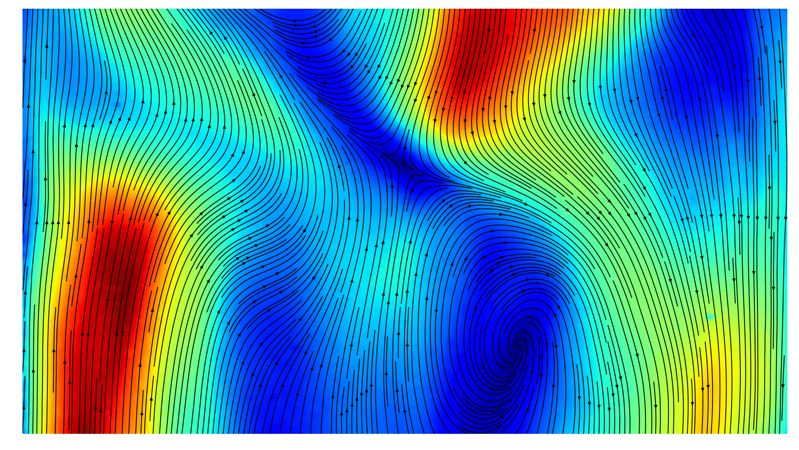

.. raw:: html

    

Welcome to PyPIV!
=================

Introduction
------------

PyPIV is a python library for Particle Image Velocimetry (PIV), including pre and postprocessing functions.
PIV is an optical technique to calculate the velocity field of  a fluid flow.
This is done by using two imagesof a fluid containing tracer particles,
that are illuminated by a laser in a plane and captured at different times.
Through a number of computations using cross-correlation and window-deformation techniques
it is possible to calculate a velocity field.

.. image:: _static/intro1.gif
    :width: 40%

The PyPIV library was initially developed in 2016 and designed to
compute fluid  flows in double diffusive convection experiments,
for this usecase the implemented methods perform outstandingly well.
Please keep in mind that this library is still in an alpha stage so there might be some issues.
If you are interested in further developing, please feel free to contact us.
Contributions are always welcome!

Install
-------

The installation can be performed directly from the git repository, a PIP package will be supported
in the future.

.. code-block:: bash

    git clone https://github.com/jr7/pypiv.git
    python setup.py build
    python setup.py install

Builduing PyPIV requires the following software installed:

1. Python 2.7.x currently this library is only supported on Python 2.7.x support for Python 3.x will come in the future.
2. Numpy  1.12.x
3. SciPy  0.18.0
4. PyFFTW 0.10.3
5. Cython 0.23.4 optional for the use of cubic interpolation in window deformation methods

API Overview
------------

.. toctree::
   :maxdepth: 2
   :caption: Contents:

   ./piv/direct_piv
   ./piv/grid_spec
   ./piv/fft_correlator
   ./piv/peak_detection
   ./piv/adaptiv_piv
   ./piv/velocity_scaler
   ./piv/interpolator
   ./piv/grid_deformator
   ./piv/velofilter
   ./piv/filters

Indices and tables
==================

* :ref:`genindex`
* :ref:`modindex`
* :ref:`search`
